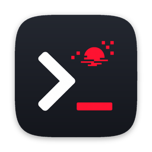

<p align="center">
  
</p>

<h1 align="center">stdusk</h1>

<p align="center"><em>the machine speaks back</em></p>

<p align="center">
A quake-style terminal with a <strong>real GUI tab bar</strong>. Native Rust, no Chromium, no apologies.<br>
It drops from the top edge on a keystroke, shows you what your machine is actually doing, and gets out of the way.
</p>

<p align="center">
By <a href="https://github.com/Hobo-Ware">HoboWare</a> - tools for the discerning degenerate.
</p>

---

## The case

Text-grid terminals (tmux, kitty, ghostty) are efficient, but they render tabs as *text* - they can never look like a GUI. Electron terminals (the [Tabby](https://github.com/Eugeny/tabby) we forked) look gorgeous but bill you a few hundred megabytes of RAM for the privilege.

stdusk refuses the tradeoff. `egui` paints real pixel-perfect tabs. `alacritty_terminal` drives the grid on the GPU. The whole thing is one native binary that starts instantly and sits quiet until you summon it.

## Install

```sh
brew install hobo-ware/tap/stdusk
```

Lands in `/Applications` (Spotlight and Launchpad find it) and puts the `stdusk` CLI on your PATH. Then hit **Ctrl+`** to summon it - it drops from the top edge, no Dock icon, no clutter. Configurable - set it to F13 if you're fancy.

## What it does

- **Progress on tabs** - the crown jewel. apt, pip, npm, curl, your 3am migration script: if it prints `N%`, the tab wears a progress bar. You don't babysit it, you glance at it.
- **Ambient CLI awareness** - got a `claude`, a `gemini`, a `codex` running somewhere in your seven tabs? Each tab tells you which, in its brand colors. Know which one is the one thinking.
- **Real GUI tabs** - colored, renameable, reorderable, split-aware. Pixels, not ASCII art.
- **Quake drop-down** - borderless, top-edge, global hotkey, hide-on-blur. There when you call, gone when you don't. Or flip `mode = "window"` and run it as a plain resizable macOS window instead.
- **One instance** - launch it again and you get a fresh tab in the running window, not a second app.
- **Splits** - panes, drag to resize, a tiny live map of the layout drawn right on the tab.
- **Scrollback search** - Cmd+F, with regex, case, and whole-word toggles.
- **Command palette** - Cmd+Shift+P, fuzzy-searched, every action two keystrokes away.
- **A real settings GUI** - Cmd+, opens a full settings view: browse 193 color schemes with live preview, tweak everything, watch it apply before you save.
- **Profiles** - named launchers with their own shell, args, cwd, env, and tab color. One right-click away.
- **Settings sync** - push your config to your own private git repo and pull it anywhere. Your credentials, your repo, no OAuth middleman.
- **Supreme defaults** - truecolor, mouse selection and copy, cwd-aware new tabs, bracketed paste, OSC 52 clipboard, shell-integration exit signals, cursor styles, ligatures, session restore.
- **Image paste** - `Ctrl+V` forwards `^V` so a tool that reads the clipboard on it (e.g. Claude Code) ingests a copied screenshot; right/middle-click paste do too when the clipboard holds an image.
- **Window or quake** - runs as the signature top-edge drop-down, or set `[quake] mode = "window"` for a regular resizable macOS window (in the Dock, no global hotkey). Single instance either way - a second launch focuses the running one and opens a new tab.

## The name

`std*` - as in `stdin`, `stdout`, `stderr` - meets *dusk*. A terminal stream at the faded end of the day. Revachol energy, no direct ripoff. The machine speaks back.

## Configure

Hit **Cmd+,** for the settings view, or edit `~/.config/stdusk/config.toml` by hand - same thing, the GUI just saves it for you. Missing file, sane defaults. See [`config.example.toml`](./config.example.toml) for the full set (theme, opacity, hotkey, cursor, bell, profiles, progress detection, CLI badges, sync).

## Build from source

```sh
cargo run
```

Rust 2024 edition. Architecture and roadmap in [`PLAN.md`](./PLAN.md); current state in [`LEDGER.md`](./LEDGER.md).

## Local signing (until notarized releases land)

Releases ship **ad-hoc signed** for now (Developer ID notarization is coming). An ad-hoc
binary has no stable code identity, so macOS won't remember the permission grants you give it
(Accessibility, Screen Recording, etc.) - you get re-prompted after upgrades. Signing the
installed app with your own self-signed cert gives it a stable identity so those grants stick.
This is local-only (the cert isn't trusted on anyone else's Mac) and needs **no Apple account**.

One-time - create a code-signing cert and sign the app:

```sh
# 1. self-signed code-signing cert (OpenSSL 3; drop -legacy on LibreSSL)
cat > /tmp/cs.cnf <<'CNF'
[req]
distinguished_name = dn
x509_extensions = v3
prompt = no
[dn]
CN = stdusk-local
[v3]
basicConstraints = critical,CA:false
keyUsage = critical,digitalSignature
extendedKeyUsage = critical,codeSigning
CNF
openssl req -x509 -newkey rsa:2048 -nodes -days 3650 -config /tmp/cs.cnf -extensions v3 \
  -keyout /tmp/stdusk-key.pem -out /tmp/stdusk-cert.pem
openssl pkcs12 -export -legacy -name stdusk-local -passout pass:stdusklocal \
  -inkey /tmp/stdusk-key.pem -in /tmp/stdusk-cert.pem -out /tmp/stdusk-local.p12

# 2. import into the login keychain (lets codesign use the key)
security import /tmp/stdusk-local.p12 -k "$HOME/Library/Keychains/login.keychain-db" \
  -P stdusklocal -T /usr/bin/codesign -A

# 3. sign the installed app + clear the stale grants
codesign --force --deep --sign "stdusk-local" /Applications/stdusk.app
tccutil reset All dev.hoboware.stdusk

# 4. tidy up the loose key material (the identity now lives in your keychain)
rm -f /tmp/stdusk-key.pem /tmp/stdusk-local.p12 /tmp/cs.cnf
```

Relaunch stdusk and approve the prompt once - it persists from then on. The
`CSSMERR_TP_NOT_TRUSTED` / "unidentified developer" notes are expected for a self-signed cert
and don't matter locally; macOS only needs the identity to be *stable*.

Every `brew upgrade` replaces the app with a fresh ad-hoc build, so re-sign after upgrades.
Add this to your shell profile:

```sh
stdusk-resign() {
  codesign --force --deep --sign "stdusk-local" /Applications/stdusk.app \
    && echo "re-signed stdusk (stable identity restored)"
}
```

Same cert -> same Designated Requirement -> your grants keep persisting, no re-approval. Once
notarized releases ship (see [`packaging/README.md`](./packaging/README.md)) this is obsolete -
those work everywhere, not just your machine.

## Lineage

stdusk began as a hard fork of [Tabby](https://github.com/Eugeny/tabby) (MIT) and is now a full Rust rewrite - this repo is the native app at its root. The original Electron Tabby source has been removed from the tree; refer to upstream [Eugeny/tabby](https://github.com/Eugeny/tabby) for it. Credit where it's due - Tabby nailed the vibe, we chased the efficiency.

## License

MIT. You made the clicks. The terminal is yours.
